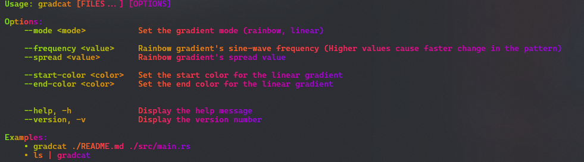

# 🌈 `gradcat` 🐈

A [`lolcat`][lolcat] clone. 'Cuz why not?

## 📘 Usage

Give it a list of files to cat out or pipe it in through `stdin`.

```sh
gradcat ./src/main.rs
```

```sh
git log | gradcat
```

### 📖 Help



> [!NOTE]
>
> Respects the `NO_COLOR` environment variable. If it is set, or if `--no-color` flag is passed, ANSI colors will be disabled - printing only plain text output. Of course, that defeats the entire point of this silly command-line application.

---

## 📄 License

This project is licensed under the [MIT License](./LICENSE). Read the [LICENSE](./LICENSE) file for more details.

<!-- LINKS -->
[lolcat]: https://github.com/busyloop/lolcat
